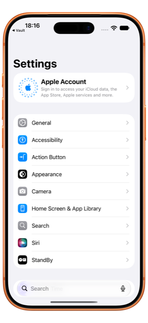
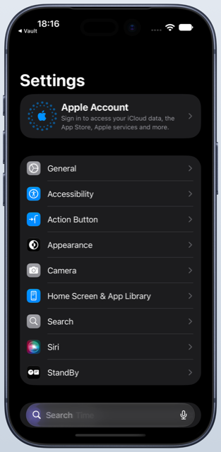
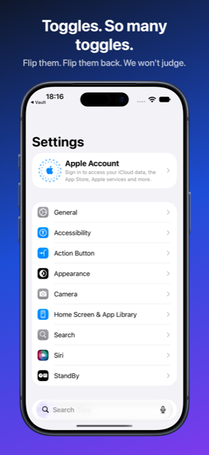
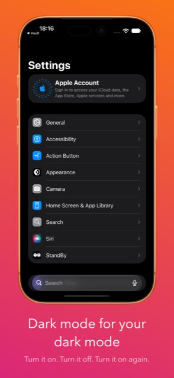
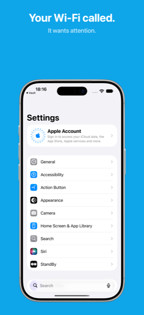
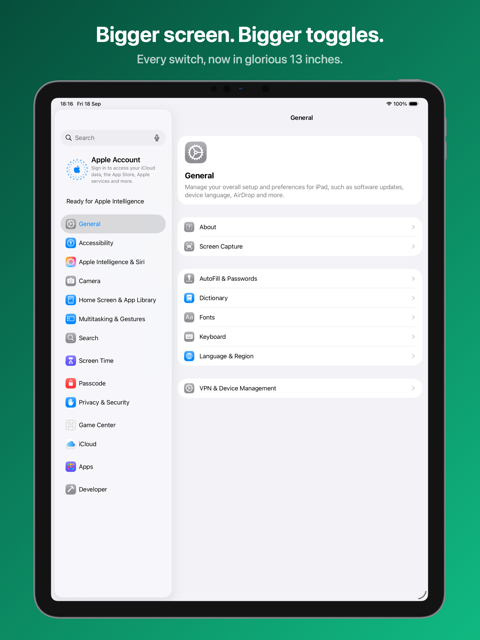

# device-screenshot-framer

`framer` is a macOS command-line tool that drops iOS and iPadOS screenshots into Apple device frames, optionally with a marketing title, subtitle and gradient background — the kind of image you upload to App Store Connect.

<table>
  <tr>
    <td align="center"><br><sub>simple mode, native size</sub></td>
    <td align="center"><br><sub>simple mode, <code>--width 900</code>, gradient</sub></td>
    <td align="center"><br><sub>inset mode, text on top</sub></td>
  </tr>
  <tr>
    <td align="center"><br><sub>inset mode, text at bottom, Avenir Next</sub></td>
    <td align="center"><br><sub>solid background, <code>deviceScale 0.9</code></sub></td>
    <td align="center"><br><sub>iPad Pro 13" via a borrowed frame</sub></td>
  </tr>
</table>

- Detects the device from the screenshot's pixel size (iPhone 5s → iPhone 17 Pro Max / Air, iPads), or force one with `--device`.
- Portrait and landscape (choose which side the notch / Dynamic Island ends up on).
- Output at any size up to the screenshot's native size, aspect-fit and centred.
- **Inset mode**: title + subtitle above or below the device on a linear gradient, rendered with CoreText (system SF font or any installed font).
- Batch rendering from a JSON config.
- No Ruby, ImageMagick or Node — just CoreGraphics, CoreText and ImageIO. Single binary, zero runtime dependencies.

Device frames are downloaded on demand from [fastlane/frameit-frames](https://github.com/fastlane/frameit-frames) and cached locally. They are not part of this repository.

---

## Contents

- [Install](#install)
- [Quick start](#quick-start)
- [CLI reference](#cli-reference)
  - [`framer frame`](#framer-frame)
  - [`framer render`](#framer-render)
  - [`framer download-frames`](#framer-download-frames)
  - [`framer list-devices`](#framer-list-devices)
  - [`framer init`](#framer-init)
  - [Global options](#global-options)
  - [Exit status and output](#exit-status-and-output)
- [Config file reference](#config-file-reference)
- [How images are built](#how-images-are-built)
- [Devices](#devices)
- [Frames cache](#frames-cache)
- [Using FramerCore as a library](#using-framercore-as-a-library)
- [Reproducing the example images](#reproducing-the-example-images)
- [Development](#development)

---

## Install

Requires macOS 14+ to run and Xcode 16+ (Swift 6) to build.

```sh
git clone https://github.com/badbundle/device-screenshot-framer.git
cd device-screenshot-framer
swift build -c release
cp .build/release/framer /usr/local/bin/   # or anywhere on your PATH
```

## Quick start

```sh
# Frame a screenshot at its native size (transparent padding, PNG)
framer frame shot.png -o framed/

# Several at once, 800px wide, in a specific colour
framer frame shots/*.png -o framed/ --width 800 --color "Deep Blue"

# Solid or gradient background behind the frame
framer frame shot.png -o framed/ --background "#1E3A8A,#9333EA" --angle 160

# Title + subtitle + gradient from a config file
framer init            # writes framer.json
framer render          # renders every entry in it

# What devices and colours are available?
framer list-devices
```

Capture screenshots from a simulator with `xcrun simctl io booted screenshot shot.png`.

---

## CLI reference

```
framer <subcommand> [options]
```

`frame` is the default subcommand, so `framer shot.png -o out/` works too.

### `framer frame`

Put screenshots into device frames (simple mode — no text, no background unless asked for).

```
framer frame [options] <inputs> ...
```

| Argument / option | Default | Description |
|---|---|---|
| `<inputs> ...` | — | One or more screenshot files (PNG or JPEG). |
| `-o, --output-dir <dir>` | `framed` | Directory for framed images. Created if missing. Output file name = input basename + format extension. |
| `--width <px>` | screenshot width | Output canvas width. |
| `--height <px>` | screenshot height | Output canvas height. |
| `--device <name>` | auto | Force a device by name or alias (case-insensitive), e.g. `"iPhone 17 Pro"`, `"iPad Pro 13"`. See [`list-devices`](#framer-list-devices). |
| `--color <name>` | device default | Frame colour, e.g. `"Deep Blue"`, `"Natural Titanium"`. Unknown colours fall back to the device default with a warning. |
| `--format <png\|jpeg>` | `png` | Output format. JPEG is flattened onto white when there is no background. |
| `--background <hex[,hex...]>` | none (transparent) | One colour for a solid fill, two or more comma-separated for a linear gradient. |
| `--angle <degrees>` | `180` | Gradient direction, CSS convention (`0` bottom→top, `90` left→right, `180` top→bottom). |
| `--landscape-side <left\|right>` | `left` | For landscape screenshots: which side the notch / Dynamic Island is on. |

Plus the [global options](#global-options).

Sizing rules (see [How images are built](#how-images-are-built)): give both `--width` and `--height` for an exact canvas; give one and the other follows the framed image's aspect ratio; give neither for the screenshot's native size. Either dimension is capped at the screenshot's native size — the tool never upscales.

### `framer render`

Render screenshots from a JSON config. This is the only way to use inset mode (title, subtitle, background per screenshot).

```
framer render [--config <file>] [--output-dir <dir>] [--only <name> ...]
```

| Option | Default | Description |
|---|---|---|
| `-c, --config <file>` | `framer.json` | Path to the config. Relative paths inside the config resolve against the config file's directory. |
| `-o, --output-dir <dir>` | config's `outputDirectory` | Override where files are written. |
| `--only <name> ...` | all | Render only entries whose `output` name or input basename matches (case-insensitive). Accepts several names. |

Plus the [global options](#global-options). See the [config file reference](#config-file-reference).

### `framer download-frames`

Prefetch every Apple frame into the cache. Not required — `frame` and `render` download what they need on demand — but useful before going offline or in CI.

```
framer download-frames [--force]
```

| Option | Description |
|---|---|
| `--force` | Re-check the upstream version even if a manifest is already cached. |

Downloads run six at a time; files already in the cache are skipped. Non-Apple frames in the upstream repo (Android, Surface, …) are never downloaded.

### `framer list-devices`

List every supported device with its portrait screenshot size, available frame colours (default marked with `*`), aliases, and whether it borrows another device's frame.

```
framer list-devices [--json]
```

`--json` prints an array of `{ name, aliases, width, height, frame, borrowedFrame, colors, defaultColor }` objects.

### `framer init`

Write a sample config to get started with `render`.

```
framer init [--path <file>] [--force]
```

| Option | Default | Description |
|---|---|---|
| `--path <file>` | `framer.json` | Where to write the config. |
| `--force` | off | Overwrite an existing file (otherwise `init` refuses). |

### Global options

Accepted by `frame`, `render` and `download-frames`:

| Option | Description |
|---|---|
| `--cache-dir <dir>` | Directory for cached frames. Overrides the `FRAMER_CACHE_DIR` environment variable and the default (`~/Library/Caches/device-screenshot-framer/frames`). |
| `--offline` | Never touch the network. Uses the cached manifest and frames; fails clearly if something needed is not cached. |
| `-v, --verbose` | Extra diagnostics on stderr (e.g. which frame a borrowed-frame device is using). |
| `-h, --help` | Help for any subcommand. |

### Exit status and output

- One line per rendered file on stdout: `✓ <path>  [<device>, <colour>, <WxH>]`.
- Failures are reported per file on stderr (`✗ <input>: <reason>`) and rendering continues with the remaining inputs. Exit status is `1` if any input failed, `0` otherwise.
- Warnings (colour fallback, clamped size, unknown font, screenshot size not matching a forced device) go to stderr and do not affect the exit status.

---

## Config file reference

Used by `framer render`. JSON, UTF-8. Every key except `screenshots` is optional; `{ "screenshots": [{ "path": "a.png" }] }` is a complete config that frames one screenshot in simple mode.

`framer init` writes this:

```json
{
  "outputDirectory": "framed",
  "output": { "width": 1290, "height": 2796, "format": "png", "jpegQuality": 0.9 },
  "mode": "inset",
  "device": null,
  "frameColor": null,
  "landscapeSide": "left",
  "background": { "colors": ["#1E3A8A", "#9333EA"], "angle": 160 },
  "text": {
    "position": "top",
    "title":    { "font": "system", "size": 96, "weight": "bold",    "color": "#FFFFFF" },
    "subtitle": { "font": "system", "size": 56, "weight": "regular", "color": "#FFFFFFCC" },
    "spacing": 24
  },
  "padding": 96,
  "gap": 64,
  "deviceScale": 1.0,
  "screenshots": [
    { "path": "raw/home.png",   "title": "Plan your day",     "subtitle": "Everything in one place" },
    { "path": "raw/detail.png", "title": "Dive into details", "device": "iPhone 17 Pro", "frameColor": "Silver", "output": "02-detail" }
  ]
}
```

### Top level

| Key | Type | Default | Description |
|---|---|---|---|
| `outputDirectory` | string | `"framed"` | Where files are written. Relative to the config file. `--output-dir` overrides. |
| `output` | object | see below | Canvas size and file format. |
| `mode` | `"simple"` \| `"inset"` | `"simple"` | `simple` = frame only. `inset` = frame + text + background. |
| `device` | string \| null | auto-detect | Default device (name or alias) for every entry. |
| `frameColor` | string \| null | device default | Default frame colour for every entry. |
| `landscapeSide` | `"left"` \| `"right"` | `"left"` | Default notch side for landscape screenshots. |
| `background` | object \| null | none | Default background. In simple mode, none means transparent padding. In inset mode, none means white. |
| `text` | object | see below | Text styling for inset mode. Ignored in simple mode. |
| `padding` | number | 5 % of canvas width | Inset mode: distance in pixels from the canvas edge to the text and the device. |
| `gap` | number | = `padding` | Inset mode: distance between the text block and the device. |
| `deviceScale` | number | `1.0` | Inset mode: multiplier on the device size within its available area. `1` fills the area; `0.8` leaves 20 % breathing room. The device stays pinned to the edge opposite the text. |
| `screenshots` | array | **required** | One entry per input image. |

### `output`

| Key | Type | Default | Description |
|---|---|---|---|
| `width` | integer \| null | screenshot width | Canvas width. |
| `height` | integer \| null | screenshot height | Canvas height. |
| `format` | `"png"` \| `"jpeg"` | `"png"` | PNG keeps transparency. JPEG is flattened onto white if there is no background. |
| `jpegQuality` | number 0–1 | `0.9` | JPEG compression quality. |

Sizing: both dims → exact canvas; one dim → the other follows the framed image's aspect; neither → native screenshot size. Never exceeds the screenshot's native size (a warning is printed if clamped).

### `background`

A solid colour or a linear gradient.

| Key | Type | Default | Description |
|---|---|---|---|
| `colors` | array of hex strings | **required** | One colour = solid fill. Two or more = gradient, first colour at the start of the gradient line. |
| `angle` | number | `180` | Direction in degrees, CSS convention: `0` bottom→top, `90` left→right, `180` top→bottom, `270` right→left. The gradient line is sized so the first and last colours land exactly on the canvas corners, like CSS `linear-gradient`. |
| `locations` | array of numbers 0–1 | evenly spaced | Optional colour stops, one per colour. |

Colours accept `#RGB`, `#RGBA`, `#RRGGBB` and `#RRGGBBAA` (the `#` is optional).

### `text`

| Key | Type | Default | Description |
|---|---|---|---|
| `position` | `"top"` \| `"bottom"` | `"top"` | Where the text block goes. The device is pushed to the opposite edge. |
| `title` | font object | bold 96 px white | Title style. |
| `subtitle` | font object | regular 56 px white @ 80 % | Subtitle style. |
| `spacing` | number | `0.4 × subtitle.size` | Vertical gap between title and subtitle. |

Font object:

| Key | Type | Default | Description |
|---|---|---|---|
| `font` | string \| null | `"system"` | `"system"` (or omitted) is the San Francisco UI font. Otherwise a PostScript name (`"AvenirNext-Bold"`), full name or family name (`"Avenir Next"`) of an installed font. Unknown names fall back to the system font with a warning — CoreText would otherwise silently substitute Helvetica. |
| `size` | number | `64` | Size in pixels of the output canvas. |
| `weight` | string \| null | font's own | `ultraLight`, `thin`, `light`, `regular`, `medium`, `semibold`, `bold`, `heavy`, `black`. Applied as a CoreText weight trait, so it works for the system font and for families like Avenir Next. Omit to use the exact face named in `font`. |
| `color` | hex string | `"#FFFFFF"` | Text colour, alpha allowed. |

Text is word-wrapped to the canvas width minus padding and centred. Newlines in `title` / `subtitle` start a new line. If the text block leaves no room for the device the entry fails with `title/subtitle block leaves no room for the device`.

### `screenshots[]`

| Key | Type | Default | Description |
|---|---|---|---|
| `path` | string | **required** | Input image, relative to the config file or absolute. `~` is expanded. |
| `title` | string | none | Inset mode title. |
| `subtitle` | string | none | Inset mode subtitle. |
| `device` | string | top-level `device` | Force a device for this entry. |
| `frameColor` | string | top-level `frameColor` | Frame colour for this entry. |
| `output` | string | input basename | Output file name without extension. |
| `background` | object | top-level `background` | Background for this entry (replaces, does not merge). |
| `landscapeSide` | `"left"` \| `"right"` | top-level `landscapeSide` | Notch side for this entry. |

In inset mode an entry with neither `title` nor `subtitle` renders with an empty text block and a warning.

---

## How images are built

1. **Detect** the device from the screenshot's pixel size (either orientation). `--device` / `device` overrides; if the forced device's size differs from the screenshot, the screenshot is scaled to fill the frame's screen and a warning is printed.
2. **Fetch the frame** for that device and colour from the cache, downloading it if needed.
3. **Composite at the frame's native pixel size.** The screenshot is aspect-filled into the screen cutout and clipped to the device's real display corner radius; the frame is drawn on top so the notch / Dynamic Island covers it. Landscape screenshots rotate the frame (90° counter-clockwise for `left`, clockwise for `right`).
4. **Size the canvas** (`width` / `height` rules above) and **aspect-fit** the framed image into it, centred.
5. **Simple mode**: fill the background if one is set, draw the framed image.
   **Inset mode**: fill the background, measure and draw the title and subtitle at `position`, then fit the device into what's left — full width minus `padding`, pinned to the edge opposite the text with `gap` between them.
6. **Write** PNG (RGBA) or JPEG (flattened).

---

## Devices

Detection is by exact pixel size. `framer list-devices` prints the full table. `--device` accepts the name or any alias, case-insensitive.

| Screenshot size | Detected as | Other devices at this size (aliases and lower-priority frames) |
|---|---|---|
| 1320×2868 | iPhone 17 Pro Max | iPhone 16 Pro Max |
| 1206×2622 | iPhone 17 Pro | iPhone 17, iPhone 16 Pro |
| 1290×2796 | iPhone 16 Plus | iPhone 15 Plus, 15 Pro Max, 14 Pro Max |
| 1179×2556 | iPhone 16 | iPhone 15, 15 Pro, 14 Pro |
| 1170×2532 | iPhone 14 | iPhone 16e, 17e, 13, 13 Pro, 12, 12 Pro |
| 1284×2778 | iPhone 14 Plus | iPhone 13 Pro Max, 12 Pro Max |
| 1080×2340 | iPhone 13 Mini | iPhone 12 Mini |
| 1260×2736 | iPhone Air | — |
| 1242×2688 | iPhone 11 Pro Max | iPhone XS Max |
| 1125×2436 | iPhone 11 Pro | iPhone XS, X |
| 828×1792 | iPhone 11 | iPhone XR |
| 1242×2208 | iPhone 8 Plus | iPhone 7 Plus, 6s Plus |
| 750×1334 | iPhone SE | iPhone 8, 7, 6s |
| 640×1136 | iPhone 5s | iPhone 5c |
| 2064×2752 | iPad Pro 13-inch (M4) | iPad Air 13-inch |
| 2048×2732 | iPad Pro (12.9-inch) (4th generation) | iPad Pro |
| 1668×2420 | iPad Pro 11-inch (M4) | — |
| 1668×2388 | iPad Pro (11-inch) | — |
| 1640×2360 | iPad Air (2020) | iPad Air 4/5, Air 11-inch, iPad 10th gen, iPad (A16) |
| 1620×2160 | iPad 10.2 | iPad 7th–9th gen |
| 1536×2048 | iPad Mini (2019) | iPad Air 2 |

When several devices share a size, the newest is detected by default; pass `--device` to pick another (e.g. `--device "iPhone 16 Pro"` for the titanium frames on a 1206×2622 screenshot).

**Borrowed frames.** Some current devices have no frame in frameit-frames. They use the closest one and the screenshot is aspect-filled into it; the small overflow disappears under the bezel.

| Screenshot | Frame used | Crop |
|---|---|---|
| iPhone 15 / 15 Pro / 16e / 17e | same-size older frame (exact) | none |
| iPhone Air (1260×2736) | iPhone 17 | ~1 px |
| iPad Pro 13" M4, iPad Air 13" (2064×2752) | iPad Pro 12.9" (4th gen) | ~0.7 % |
| iPad Pro 11" M4 (1668×2420) | iPad Pro 11" | 16 px top/bottom |

iPad mini 6/7 (1488×2266) is deliberately unsupported: the nearest frame would crop 3 %. Force it with `--device "iPad Air (2020)"` if you accept that.

---

## Frames cache

Frames come from the `gh-pages` branch of [fastlane/frameit-frames](https://github.com/fastlane/frameit-frames) (`latest/`). The upstream repo is community-maintained and updates infrequently (roughly yearly; iPhone 16/17 frames arrived in 2026), which is why the borrowed-frame aliases above exist.

```
~/Library/Caches/device-screenshot-framer/frames/
  current-version                 # e.g. 1772014847
  1772014847/
    files.json                    # upstream file list
    offsets.json                  # screen cutout position per frame
    Apple iPhone 17 Pro Silver.png
    ...
```

- The manifest (`files.json`, `offsets.json`) is fetched once and reused; it is only re-checked when a needed frame is missing or with `download-frames --force`.
- Each frame PNG (~0.5 MB) is downloaded the first time that device + colour is used.
- If the network is unreachable, the cached version is used with a warning.
- Override the location with `--cache-dir` or `FRAMER_CACHE_DIR`.

---

## Using FramerCore as a library

The package exports a `FramerCore` library; the CLI is a thin wrapper over it.

```swift
// Package.swift
.package(url: "https://github.com/badbundle/device-screenshot-framer.git", branch: "main")
// target dependency:
.product(name: "FramerCore", package: "device-screenshot-framer")
```

High level — one call per screenshot:

```swift
import FramerCore

let store = FrameStore()                       // default cache + upstream URL
let renderer = Renderer(store: store)

let job = RenderJob(
    input: URL(fileURLWithPath: "shot.png"),
    outputBase: URL(fileURLWithPath: "out/shot"),   // extension added from `format`
    format: .png,
    mode: .inset,
    frameColor: "Deep Blue",
    requestedWidth: 1206,
    background: GradientSpec(colors: [try RGBAColor(hex: "#0F172A"), try RGBAColor(hex: "#7C3AED")], angleDegrees: 160),
    inset: RenderJob.InsetSettings(
        title: "Toggles. So many toggles.",
        subtitle: "Flip them. Flip them back.",
        titleStyle: TextStyle(font: FontSpec(size: 92, weight: .bold), color: .white),
        subtitleStyle: TextStyle(font: FontSpec(size: 52), color: .white),
        position: .top, spacing: 20, padding: 90, gap: 56, deviceScale: 1
    )
)

let (outcomes, failures) = await renderer.run([job])
```

`Renderer.run` never throws; it returns per-job outcomes and errors. For finer control, `Renderer.prepare(_:manifest:)` (async: detect device, fetch frame) and `Renderer.render(_:)` (synchronous: all CoreGraphics work) can be called separately. Loading a config file: `ConfigLoader.load(url)` → `ConfigLoader.jobs(from:baseDirectory:)`.

Lower-level pieces, all public:

| Type | Role |
|---|---|
| `DeviceCatalog` / `Device` | The device table: `detect(PixelSize)`, `named(String)`. |
| `FrameStore` / `FrameManifest` / `FrameResolver` | Download, cache and resolve frames and their screen offsets. `FrameStore.fetch` is injectable for tests. |
| `FrameGeometry` / `OrientedGeometry` | Cutout rect, aspect-fill/fit maths, landscape transforms. |
| `FrameCompositor` | Screenshot + frame → framed `CGImage` at native size. |
| `SimpleRenderer` / `InsetRenderer` / `InsetLayout` | The two output modes; `InsetLayout.compute` is pure layout maths. |
| `TextRenderer` / `TextStyle` / `FontSpec` / `FontWeight` | CoreText measuring and drawing. |
| `GradientSpec` / `RGBAColor` | Backgrounds and colours. |
| `ImageLoader` / `ImageWriter` / `OutputFormat` | ImageIO in and out. |
| `FramerConfig` and friends | `Codable` config schema. |
| `FramerError` | Every error the library throws, with a human-readable `description`. |

`CGImage` / `CGContext` are never held across `await`; `FrameStore` returns only URLs and value types, so the library is safe under Swift 6 strict concurrency.

---

## Reproducing the example images

The images at the top were made from iOS Simulator screenshots of the Settings app. Configs live in [`docs/examples/`](docs/examples/); they expect the raw screenshots in `docs/examples/raw/`.

```sh
# Capture (any booted iPhone / iPad simulator; Settings for variety)
xcrun simctl launch booted com.apple.Preferences
xcrun simctl io booted screenshot docs/examples/raw/settings-light.png
xcrun simctl ui booted appearance dark
xcrun simctl io booted screenshot docs/examples/raw/settings-dark.png

# Simple mode
framer frame docs/examples/raw/settings-light.png -o out --color "Cosmic Orange"
framer frame docs/examples/raw/settings-dark.png  -o out --width 900 --color "Deep Blue" --background "#E2E8F0,#CBD5E1"

# Inset mode
framer render --config docs/examples/inset.json          # text on top; iPhone + iPad
framer render --config docs/examples/inset-bottom.json   # text at bottom, Avenir Next
framer render --config docs/examples/inset-solid.json    # solid background, deviceScale 0.9
```

The committed PNGs are downscaled to 640 px for the README; the tool's output is full resolution.

---

## Development

```sh
swift build
swift test          # 72 tests; synthetic frames, no network
```

- `Sources/FramerCore` — the library (device table, frame store, geometry, rendering, config, pipeline).
- `Sources/framer` — the CLI (swift-argument-parser).
- `Tests/FramerCoreTests` — swift-testing suites. Frames and screenshots are generated in-process; the frame store is tested with an injected in-memory fetcher.
- CI runs `swift build`, `swift test` and a release-build smoke test on `macos-15` (Xcode 16.4) and `macos-26`.

Everything renders through CoreGraphics in top-left pixel coordinates; the only y-flip is `CGRect.flipped(in:)`.
